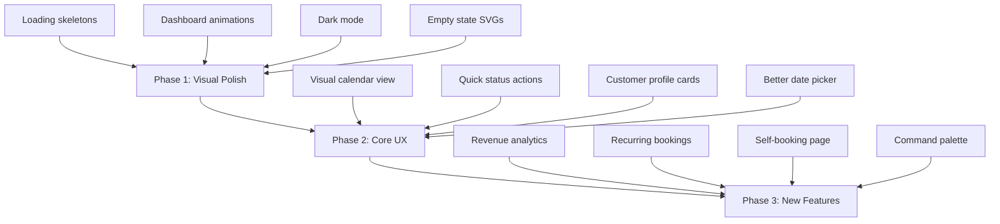

# BizFlow — Full App Understanding & Next-Level UX Recommendations

## What the App Is

**BizFlow** is a multi-tenant SaaS for UK local businesses (launching with salons/barber shops). Built with **Laravel 12 + Livewire 3 (Volt) + TailwindCSS**, it runs on XAMPP locally and uses SQLite.

### Core Features
| Module | What It Does | Key File |
|--------|-------------|----------|
| **Dashboard** | Today's bookings, earnings, tomorrow's reminders, lapsed customers, setup checklist | [dashboard.blade.php](file:///c:/xampp/htdocs/bizapp/resources/views/livewire/dashboard.blade.php) |
| **Diary** (Appointments) | Day-view booking list with add/edit modal, conflict detection, status changes | [appointments/index.blade.php](file:///c:/xampp/htdocs/bizapp/resources/views/livewire/appointments/index.blade.php) |
| **Customers** | Customer list with search, filter (all/lapsed), Telegram linking, consent tracking | [customers/index.blade.php](file:///c:/xampp/htdocs/bizapp/resources/views/livewire/customers/index.blade.php) |
| **Services** | Service menu CRUD (name, duration, price, active/inactive, sort order) | [services/index.blade.php](file:///c:/xampp/htdocs/bizapp/resources/views/livewire/services/index.blade.php) |
| **Staff** | Staff member management (name, phone, color, active, sort order) | [staff/index.blade.php](file:///c:/xampp/htdocs/bizapp/resources/views/livewire/staff/index.blade.php) |
| **Messaging** | Automated 24h appointment reminders via Telegram (planned: WhatsApp, Email, SMS) | [Messaging/](file:///c:/xampp/htdocs/bizapp/app/Messaging) |
| **Auth** | Laravel Breeze auth (register, login, forgot password, email verification) | [auth.php](file:///c:/xampp/htdocs/bizapp/routes/auth.php) |

### Architecture Highlights
- **Multi-tenant**: `BelongsToBusiness` trait auto-scopes all queries by `business_id`
- **Phone-first design**: Bottom tab bar for mobile, 44px touch targets, `safe-area-inset-bottom` padding
- **Timezone-aware**: All dates stored UTC, converted to business local time for display
- **GDPR/PECR compliant**: Separate transactional vs marketing consent, unsubscribe tracking
- **Mulberry brand color** (`#7d2f51`) chosen to avoid clashing with status colors

---

## Current UX Strengths ✅

1. **Mobile-first navigation** — Bottom tab bar with "Today → Diary → Customers → More" follows Instagram/WhatsApp patterns
2. **Smart setup checklist** — Dashboard shows onboarding steps instead of empty zeros
3. **Actionable dashboard** — "Needs action" panel, unreachable customer warnings, lapsed count
4. **Conflict detection** — Diary warns about double bookings but allows override
5. **Inline customer creation** — Can add a new customer while booking an appointment
6. **Accessibility** — Skip-to-content link, ARIA labels, keyboard navigation, screen reader live regions

---

## 🚀 Next-Level UX Improvements

### Priority 1: High Impact, Moderate Effort

#### 1. Visual Calendar View for the Diary
**Currently**: The diary is a flat list of appointments for one day.
**Upgrade**: Add a **timeline/grid view** showing time slots (e.g., 08:00–20:00) as rows, with staff members as columns. Appointments appear as colored blocks. This is the #1 expected UX in any booking app.

> [!IMPORTANT]
> This is the single biggest UX win. Every competing salon app (Fresha, Timely, Square) uses a visual calendar grid. A flat list makes it hard to spot gaps and visualize the day.

#### 2. Quick Actions on Appointment Cards
**Currently**: Changing a status requires opening the edit form.
**Upgrade**: Add **swipe actions** (mobile) or **hover action buttons** (desktop) on each appointment row:
- ✅ Mark Complete
- ❌ Cancel
- 🚫 No-show
- These call `changeStatus()` directly with a confirmation toast.

#### 3. Search & Booking from Anywhere (Command Palette)
Add a **global search** (`Ctrl+K` / tap the search icon) that searches across customers, appointments, and services. Think Spotlight or Linear's command palette. From results, you can jump to a customer or create a booking instantly.

#### 4. Real-Time Notification Bell
**Currently**: No in-app notifications.
**Upgrade**: Add a notification bell in the top bar showing:
- Upcoming appointments (30 min warning)
- Failed message deliveries
- New Telegram link-ups
- Use Livewire polling or Laravel Echo for real-time updates.

---

### Priority 2: Polish & Delight

#### 5. Dark Mode Support
Add a dark mode toggle. The app uses TailwindCSS so adding `dark:` variants is straightforward. Salon owners often check their phone in dim lighting.

#### 6. Animated Dashboard Cards
**Currently**: Dashboard stat cards are plain white boxes.
**Upgrade**:
- Subtle **count-up animations** for numbers (today's bookings, revenue)
- **Gradient accents** on the left edge of cards using the mulberry palette
- **Micro-progress indicators** (e.g., a thin progress bar showing % of today's bookings completed)

#### 7. Drag-and-Drop Appointment Rescheduling
In the visual calendar (from #1), allow **dragging an appointment block** to a new time slot or staff member. Confirmation modal shows the old vs. new time. Automatically checks for conflicts.

#### 8. Customer Profile Cards
**Currently**: Customers are a flat table/list.
**Upgrade**: When tapping a customer, show a **profile card** with:
- Visit history timeline
- Total spend & average ticket
- Preferred channel + link status indicator
- Quick "Book appointment" button
- Notes section with rich text

#### 9. Onboarding Tour
Add a **guided tour** (using a library like Shepherd.js or a custom Alpine component) for first-time users:
1. "Add your first service" → highlights Services tab
2. "Add a customer" → highlights Customers tab
3. "Book your first appointment" → highlights the + button in Diary
4. "Set up reminders" → shows Telegram connection

#### 10. Loading Skeleton States
**Currently**: Pages show nothing or a spinner during Livewire updates.
**Upgrade**: Add **skeleton loading states** (pulsing gray blocks matching the card layout) for:
- Dashboard cards
- Appointment list
- Customer table
This makes the app feel faster even when it isn't.

---

### Priority 3: Feature Additions for Stickiness

#### 11. Revenue Analytics Page
A new **Analytics** page with:
- Weekly/monthly revenue chart (line or bar)
- Top services by booking count and revenue
- Busiest hours/days heatmap
- No-show rate trend
- Customer retention metrics

#### 12. Recurring Appointments
Allow marking an appointment as "repeating" (weekly, bi-weekly, monthly). The system creates future bookings and reminders automatically. This is a top-requested feature in salon software.

#### 13. Customer Self-Booking Page
A **public booking link** (`bizflow.app/book/bright-hair-studio`) where customers can:
- See available time slots
- Pick a service and staff member
- Book themselves
- This eliminates phone tag and is a major differentiator.

#### 14. WhatsApp/SMS Template Previews
In the customer detail or dashboard, show a **preview of what the reminder message will look like** on each channel. This builds trust with the business owner.

#### 15. Bulk Actions on Customer List
Allow selecting multiple customers and applying:
- Send marketing message
- Change preferred channel
- Export as CSV
- Add/remove tags

---

### Priority 4: Quality-of-Life Improvements

| Improvement | Effort | Impact |
|-------------|--------|--------|
| **Keyboard shortcuts** (N = new booking, / = search, ← → = navigate days) | Low | Medium |
| **Empty state illustrations** (custom SVGs instead of plain text) | Low | Medium |
| **Better date picker** (calendar dropdown instead of HTML date input) | Low | High |
| **Appointment duration auto-fill** from selected service | Already exists | — |
| **Undo on delete** (soft-delete with 10s undo toast instead of confirm dialog) | Medium | High |
| **Haptic feedback** on mobile for status changes | Low | Low |
| **Business branding** (let owner upload logo, choose accent color) | Medium | Medium |
| **Multi-language support** (i18n for Bangla, Arabic salon owners) | High | Medium |
| **Offline-capable PWA** (service worker for viewing today's diary without internet) | High | High |

---

## Recommended Implementation Order

## Quick Wins You Could Start Today

1. **Add `wire:loading` skeleton states** to dashboard cards — 30 mins of work, immediate perceived performance gain
2. **Add count-up animation** to the dashboard's big numbers — use a tiny Alpine plugin, 15 mins
3. **Add hover states and transitions** to all interactive cards — pure CSS, 20 mins
4. **Add empty state illustrations** — generate SVGs, drop them in, 30 mins
5. **Add keyboard shortcut for "New Booking"** — single Alpine listener, 10 mins

---

> [!TIP]
> The biggest bang-for-buck is **Priority 1, Item 1: Visual Calendar View**. It transforms the Diary from a list into a professional booking interface. Every salon owner comparing BizFlow to Fresha will look for this first.

Which improvements interest you most? I can create a detailed implementation plan for any of these and start building.
